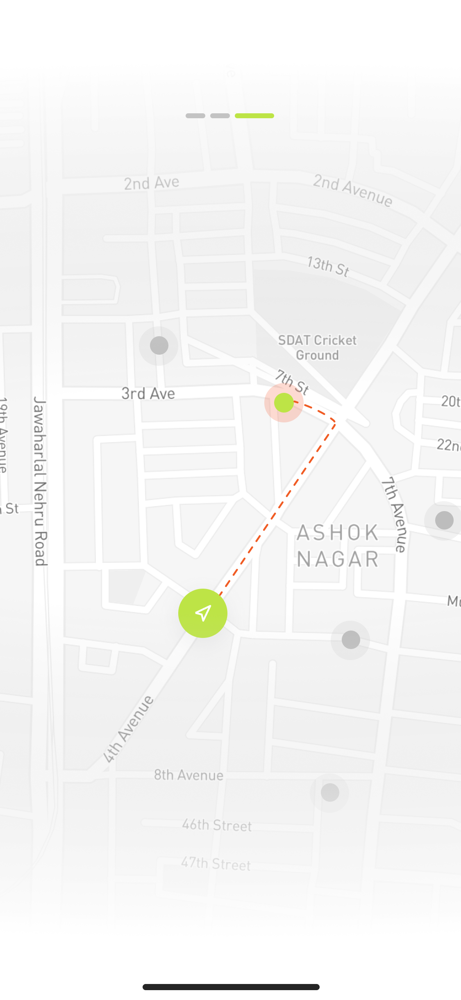

# AI Tourists

> An AI-powered travel companion built with Flutter.

AI Tourists helps travelers discover nearby places, explore locations on a map, get AI-assisted travel guidance, save favorite places, and plan bookings from one mobile app.

## Highlights

- Location-aware nearby place discovery
- Google Maps integration with place details
- AI travel assistant and personalized suggestions
- Interactive travel quiz with answer feedback and sharing
- Save places and view saved maps
- Booking flow and subscription support
- Sign up, sign in, verification, password reset, and profile management
- Localized UI with English and Bengali support
- Light theme, audio guidance, image caching, and share support

## Built with

- **Flutter** and **Dart**
- **GetX** for state management and dependency injection
- **Google Maps**, geocoding, and geolocator for location features
- **HTTP** and environment-based configuration for API access
- **Get Storage** for local persistence
- **Flutter EasyLoading**, `just_audio`, `cached_network_image`, and `share_plus`

## Screenshots

| Discover | AI assistant | Map |
| --- | --- | --- |
|  |  |  |

> Replace these showcase images with final product screenshots when the release build is ready.

## Requirements

- Flutter SDK compatible with Dart `^3.9.0`
- Android Studio with an Android SDK for Android builds
- Xcode and CocoaPods for iOS builds (macOS only)
- Google Maps API key
- Backend/API credentials used by the app

Check your local installation with:

```bash
flutter doctor
```

## Quick start

### 1. Clone the repository

```bash
git clone https://github.com/ahizaz/ai_tourists_apps.git
cd ai_tourists_apps
```

### 2. Install dependencies

```bash
flutter pub get
```

### 3. Configure secrets

Copy the templates and replace every placeholder with local credentials:

**Windows PowerShell**

```powershell
Copy-Item .env.example .env
Copy-Item lib\core\config\api_keys.dart.example lib\core\config\api_keys.dart
Copy-Item android\local.properties.example android\local.properties
Copy-Item android\key.properties.example android\key.properties
Copy-Item ios\Runner\GoogleMapsConfig.swift.example ios\Runner\GoogleMapsConfig.swift
```

**macOS/Linux**

```bash
cp .env.example .env
cp lib/core/config/api_keys.dart.example lib/core/config/api_keys.dart
cp android/local.properties.example android/local.properties
cp android/key.properties.example android/key.properties
cp ios/Runner/GoogleMapsConfig.swift.example ios/Runner/GoogleMapsConfig.swift
```

Then configure:

- `GOOGLE_MAPS_API_KEY` in `.env`
- the Dart API key template in `lib/core/config/api_keys.dart`
- Android SDK/Flutter paths and map key in `android/local.properties`
- iOS map key in `ios/Runner/GoogleMapsConfig.swift`
- release signing values in `android/key.properties` only when making a signed Android build

Read the complete [API key setup guide](API_KEY_SETUP.md) before enabling maps. Never commit `.env`, local properties, API key files, signing files, or keystores.

### 4. Run the app

```bash
flutter devices
flutter run
```

## Development commands

```bash
# Analyze the project
flutter analyze

# Run tests
flutter test

# Format Dart code
dart format lib test

# Build an Android APK
flutter build apk --release

# Build an Android App Bundle for Google Play
flutter build appbundle --release
```

## Project structure

```text
lib/
├── app.dart                  # Application theme, localization, and root widget
├── main.dart                 # Bootstrap and dependency registration
├── core/                     # Shared services, config, localization, and widgets
├── features/
│   ├── auhtentication/       # Auth and onboarding flows
│   ├── home/                 # Discovery, nearby places, and place details
│   ├── map/                  # Maps and location details
│   ├── ai/                   # AI travel assistant
│   ├── booking/              # Booking flow
│   ├── profile/              # Profile, saved places, quiz, and subscription
│   └── bottom_navbar/        # Main app navigation
└── utils/                    # Theme, colors, assets, and share helpers
```

## Documentation

- [API key and local configuration](API_KEY_SETUP.md)
- [Interactive quiz feature](INTERACTIVE_QUIZ_FEATURE.md)
- [Location details feature](LOCATION_DETAILS_FEATURE.md)
- [Quiz suggestion feature](QUIZ_SUGGESTION_FEATURE.md)
- [Terms and conditions](TERMS_AND_CONDITIONS_DALIL.md)

## GitHub workflow

Every push and pull request runs the Flutter checks in [`.github/workflows/flutter.yml`](.github/workflows/flutter.yml). Before opening a pull request:

1. Run `flutter analyze`.
2. Run `flutter test`.
3. Run `dart format --set-exit-if-changed lib test`.
4. Confirm that no secret or generated build file is staged with `git status`.

To publish changes to the configured GitHub repository:

```bash
git add .
git commit -m "docs: prepare project for GitHub"
git push origin izaz
```

For a public release, create a GitHub Release and attach the signed `.aab` or `.apk` generated locally. Do not upload signing keys or API credentials.

## Security

If a credential is ever committed, revoke it immediately, create a replacement, and remove it from the repository history. The repository ignores the local credential files listed above, but always verify staged files before pushing.

## License

No open-source license has been selected yet. Until a license is added, the source remains all rights reserved.
